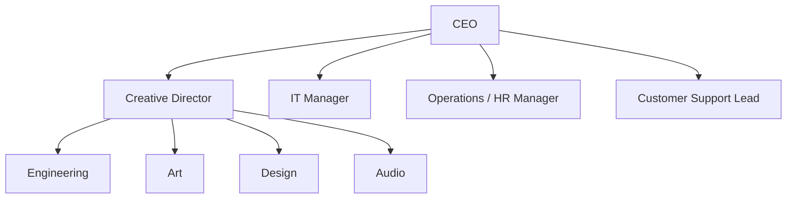

# Entra ID Foundations Lab - Scenario

# Scenario

You are the IT administrator for a new company called The Blaze Faction, a new gaming studio. You need to help set up a simple identity infrastructure based on the companies 
corporate structure and information below:

**Corporate Structure:**

**Table of Job Titles:**

| Department       | Job Title              | Roles                                         | M365 Groups | Security Group     |   |
| ---------------- | ---------------------- | --------------------------------------------- | ----------- | ------------------ | - |
| Executive        | CEO                    | Studio oversight, budgeting, approvals        |             | sg_Executive       |   |
| Engineering      | Lead Software Engineer | Architecture, repo admin, CI/CD oversight     | m365_GameDevTeam            | sg_Engineering     |   |
| Engineering      | Developer              | Feature development, code review              | m365_GameDevTeam            | sg_Engineering     |   |
| Engineering      | QA Tester              | Testing, bug tracking                         | m365_GameDevTeam             | sg_Engineering     |   |
| Art              | Art Director           | Visual direction, asset approval              | m365_CreativeTeam           | sg_Art             |   |
| Art              | 3D Artist              | Modeling, texturing, asset creation           | m365_CreativeTeam           | sg_Art             |   |
| Art              | Concept Artist         | Concept art, illustrations                    | m365_CreativeTeam            | sg_Art             |   |
| Design           | UX/UI Designer         | Interface design, prototyping                 | m365_CreativeTeam           | sg_Design          |   |
| Audio            | Audio Lead             | Audio direction, mixing                       | m365_CreativeTeam            | sg_Audio           |   |
| Audio            | Sound Designer         | SFX creation, editing                         | m365_CreativeTeam             | sg_Audio           |   |
| IT               | IT Manager             | Infrastructure, security, identity management |  m365_ITOps           | sg_IT              |   |
| Operations / HR  | HR Manager             | Hiring, payroll, compliance                   | m365_HROperations            | sg_HumanResources  |   |
| Customer Support | Support Lead           | Ticket escalation, QA                         | m365_CustomerSuccess            | sg_CustomerSupport |   |
| Customer Support | Support Specialist     | Customer tickets                              |m365_CustomerSuccess             | sg_CustomerSupport | _ |

**Table of Entra ID groups (based on Departments) and corresponding dynamic group rule:**

| Security Group           | Department          | Dynamic membership rule                     |
| ------------------------ | ------------------- | ------------------------------------------- |
| `sg_Executive`           | Executive           | `user.department -eq "Executive"`           |
| `sg_Art`                 | Art                 | `user.department -eq "Art"`                 |
| `sg_Audio`               | Audio               | `user.department -eq "Audio"`               |
| `sg_Customer Support`    | Customer Support    | `user.department -eq "Customer Support"`    |
| `sg_Design`              | Design              | `user.department -eq "Design"`              |
| `sg_Engineering`         | Engineering         | `user.department -eq "Engineering"`         |
| `sg_IT`               | IT                  | `user.department -eq "IT"`                  |
| `sg_OperationsHR`        | Operations / HR     | `user.department -eq "Operations / HR"`     |

**Leadership Groups and dynamic rules:**

**Required SaaS applications:**

| SaaS Product                 | Website |
|------------------------------|-----------------------------------------------------------|
| Microsoft 365 Business Standard | https://www.microsoft.com/microsoft-365/business |
| Microsoft 365 Business Premium  | https://www.microsoft.com/microsoft-365/business |
| GitHub Team                    | https://github.com/pricing |
| GitHub Enterprise              | https://github.com/enterprise |
| Adobe Creative Cloud           | https://www.adobe.com/creativecloud.html |
| Autodesk Maya                  | https://www.autodesk.com/products/maya |
| Blender                        | https://www.blender.org/download |
| Figma Professional             | https://www.figma.com/pricing |
| Pro Tools Studio               | https://www.avid.com/pro-tools |
| Pro Tools Artist               | https://www.avid.com/pro-tools |
| Reaper                         | https://www.reaper.fm/purchase.php |
| HRIS Basic (BambooHR/HiBob/etc.) | https://www.bamboohr.com / https://www.hibob.com |
| Jira                           | https://www.atlassian.com/software/jira |
| Confluence                     | https://www.atlassian.com/software/confluence |

**Note:** BlazeFaction utilizes multiple SaaS applications across engineering, creative, operations, and support teams. Due to lab scope constraints, only selected applications were integrated with Microsoft Entra ID. Additional applications are documented as future identity integrations.

**Applications implemented:**

✅ Microsoft 365 Business Premium
✅ GitHub Team
✅ Jira
✅ Confluence
✅ Adobe Creative Cloud 

