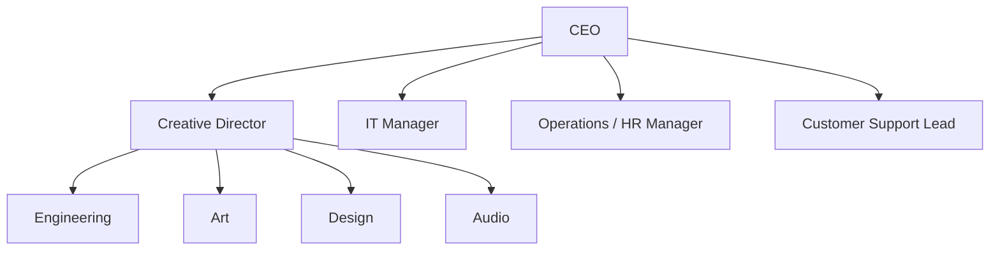

# Entra ID Foundations Lab - Scenario

# Scenario

You are the IT administrator for a new company called The Blaze Faction, a new gaming studio. You need to help set up a simple identity infrastructure based on the companies 
corporate structure and information below:

**Corporate Structure:**

**Table of Job Titles:**

| Department           | Job Title                | Roles                                                       | Licenses                                      | Access Level |
|----------------------|---------------------------|-------------------------------------------------------------|------------------------------------------------|--------------|
| Executive            | CEO                       | Studio oversight, budgeting, approvals                     | Microsoft 365 Business Standard               | Level 4 – High access |
| Creative Leadership  | Creative Director         | Creative vision, project oversight                          | Adobe Creative Cloud, Microsoft 365 BS        | Level 3 – Creative systems |
| Engineering          | Lead Software Engineer    | Architecture, repo admin, CI/CD oversight                   | GitHub Team/Enterprise, Microsoft 365 BS      | Level 3 – Engineering elevated |
| Engineering          | Developer                 | Feature development, code review                            | GitHub Team, Microsoft 365 BS                 | Level 2 – Engineering standard |
| Engineering          | QA Tester                 | Testing, bug tracking                                       | Microsoft 365 Business Standard               | Level 1 – Limited engineering |
| Art                  | Art Director              | Visual direction, asset approval                            | Adobe Creative Cloud                          | Level 3 – Creative elevated |
| Art                  | 3D Artist                 | Modeling, texturing, asset creation                         | Adobe Creative Cloud, Autodesk Maya/Blender   | Level 2 – Creative workstation |
| Art                  | Concept Artist            | Concept art, illustrations                                  | Adobe Creative Cloud                          | Level 1 – Creative standard |
| Design               | UX/UI Designer            | Interface design, prototyping                               | Figma Professional, Microsoft 365 BS          | Level 2 – Design access |
| Audio                | Audio Lead                | Audio direction, mixing                                     | Pro Tools Studio or Reaper, Microsoft 365 BS  | Level 2 – Audio elevated |
| Audio                | Sound Designer            | SFX creation, editing                                       | Pro Tools Artist or Reaper                    | Level 1 – Audio standard |
| IT                   | IT Manager                | Infrastructure, security, identity management               | Microsoft 365 Business Premium                | Level 4 – IT admin |
| Operations / HR      | HR Manager                | Hiring, payroll, compliance                                 | Microsoft 365 Business Standard, HRIS Basic   | Level 2 – HR access |
| Customer Support     | Support Lead              | Ticket escalation, QA                                       | Zendesk Admin, Microsoft 365 BS               | Level 2 – Support elevated |
| Customer Support     | Support Specialist        | Customer tickets                                            | Zendesk Agent, Microsoft 365 BS               | Level 1 – Support standard |

**Required SaaS applications:**

| SaaS Product                 | Website |
|------------------------------|-----------------------------------------------------------|
| Microsoft 365 Business Standard | https://www.microsoft.com/microsoft-365/business |
| Microsoft 365 Business Premium  | https://www.microsoft.com/microsoft-365/business |
| GitHub Team                    | https://github.com/pricing |
| GitHub Enterprise              | https://github.com/enterprise |
| Adobe Creative Cloud           | https://www.adobe.com/creativecloud.html |
| Autodesk Maya                  | https://www.autodesk.com/products/maya |
| Blender                        | https://www.blender.org/download |
| Figma Professional             | https://www.figma.com/pricing |
| Pro Tools Studio               | https://www.avid.com/pro-tools |
| Pro Tools Artist               | https://www.avid.com/pro-tools |
| Reaper                         | https://www.reaper.fm/purchase.php |
| HRIS Basic (BambooHR/HiBob/etc.) | https://www.bamboohr.com / https://www.hibob.com |
| Jira                           | https://www.atlassian.com/software/jira |
| Confluence                     | https://www.atlassian.com/software/confluence |

**We can get our Microsoft 365 licensing through the developer program: https://developer.microsoft.com/en-us/microsoft-365/dev-program**

