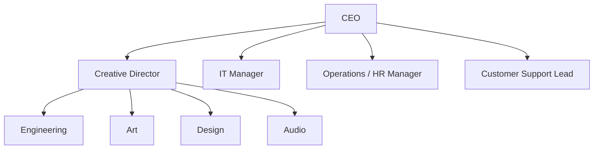

# Entra ID Foundations Lab - Scenario

# Scenario

You are the IT administrator for a new company called The Blaze Faction, a new gaming studio. You need to help set up a simple identity infrastructure based on the companies 
corporate structure below:

Also include is a 

